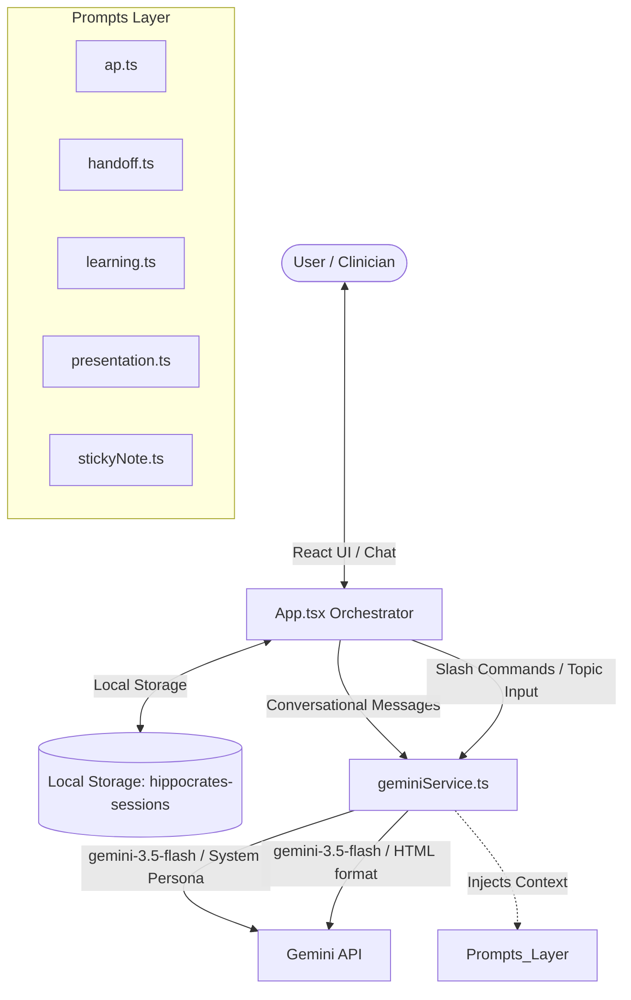

# Hippocrates: AI Hospitalist Mentor & Clinical Co-Pilot
## Project Documentation

Hippocrates is a web-based clinical decision-support and educational tool designed to act as an on-demand mentor and clinical co-pilot for hospital medicine physicians, residents, and medical students. Embodying the wisdom of a master academic hospitalist, the application utilizes Google Gemini models to guide clinical reasoning, generate structured clinical documentation, and create board-style clinical algorithms.

---

## 🏗️ System Architecture & Data Flow

Hippocrates is designed as a client-side single-page application (SPA). It communicates directly with Google's Gemini APIs from the frontend, ensuring minimal latency and zero middle-tier backend requirements.



### 1. Core Data Flow
1. **Initiation**: The clinician enters a patient presentation (e.g., *78M with acute shortness of breath and edema*).
2. **UI Action Selection**: Instead of calling the Gemini API immediately, the UI intercepts the first case input and renders a choice prompt card in the feed. This prompts the user to select their desired target output (Socratic Mentorship, Daily Progress Plan, Rounds Presentation, IPASS Handoff, Quick Sticky Note, or Clinical Simulation).
3. **Execution**:
   - If **Socratic Mentorship** is clicked, the app sends the patient details to the Socratic chat session (`gemini-3.5-flash`).
   - If any **Generative Command** is clicked, the app appends the corresponding command (e.g., `/assessment_and_plan`) and streams the formatted output.
4. **Local Persistence**: Sessions, chat logs, summaries, and generated algorithms are automatically serialized and saved to `localStorage` under `hippocrates-sessions`.
5. **Document Generation**: If a user runs a slash command at any point (e.g., `/handoff`), the system retrieves the full chat history, formats it, and feeds it into a specialized prompt template from the `prompts/` directory to generate structured, guidelines-compliant clinical documents.
6. **Educational Review (Master Algorithm)**: The user can type `/clinicalalgorithm [topic]` directly in the chat input. The system prompts the `gemini-3.5-flash` model to build an interactive, high-yield clinical thinking path (ABIM board-prep style) for that topic, rendering it directly inside the message feed using Tailwind CSS styling.

---

## 🛠️ Technology Stack

* **Frontend Framework**: [React 19](https://react.dev) (Functional components, hooks, refs, and contexts)
* **Build System & Dev Server**: [Vite 6](https://vite.dev) (Fast, ESM-based bundling)
* **Styling**: [Tailwind CSS](https://tailwindcss.com) (Loaded client-side via CDN with theme extensions defined in [index.html](file:///Users/sku/drsku6/hippocrates/index.html))
* **Language**: [TypeScript 5](https://www.typescriptlang.org) (Rigorous typing for application models, messages, and API payloads)
* **LLM Integration**: [@google/genai SDK v1.25.0](https://www.npmjs.com/package/@google/genai) (Official Google GenAI SDK using `GoogleGenAI` class and streaming utilities)
* **Markdown Rendering**: `react-markdown` and `remark-gfm` (Ensures clean, structured display of clinical guidelines, lists, and bold callouts in chat bubbles)

---

## 📁 Project Directory Structure

```
hippocrates/
├── components/
│   ├── Feedback.tsx        # Floating feedback modal with rating and comment capture
│   └── icons.tsx           # Collection of SVG icons used throughout the UI
├── prompts/                # Specialized prompt engineering templates
│   ├── ap.ts               # Daily progress note Assessment & Plan format
│   ├── handoff.ts          # SBAR/IPASS written handoff formatter
│   ├── learning.ts         # Case summary JSON parser & Master Algorithm prompts
│   ├── presentation.ts     # Polish oral presentation format for rounds
│   └── stickyNote.ts       # Hyper-concise quick-reference format
├── services/
│   └── geminiService.ts    # Initializer and API router for the `@google/genai` client
├── App.tsx                 # Main application UI layout, state manager, and resize logic
├── constants.ts            # Defines the AI Persona directives and UI commands list
├── index.html              # Entrypoint HTML including Tailwind configuration and module mounts
├── index.tsx               # Root React renderer mounting App.tsx to the DOM
├── types.ts                # TypeScript interfaces for Message, Session, and PatientSummary
├── tsconfig.json           # TypeScript compilation parameters
├── package.json            # Scripts, dependencies, and metadata configuration
└── vite.config.ts          # Vite configuration exposing API keys to the client bundles
```

---

## 🧩 Component & Service Breakdown

### 1. Main Application Orchestrator ([App.tsx](file:///Users/sku/drsku6/hippocrates/App.tsx))
Manages the application state, including:
* **Sidebar Resize**: Implements a custom mouse move/up listener supporting smooth dragging of the navigation panel (between 200px and 500px).
* **Session Switcher**: Detects existing sessions in `localStorage`, creates unique session IDs using `crypto.randomUUID()`, and manages chat logs.
* **Message Router**: Intercepts chat submissions. Regular text triggers Socratic responses, while slash commands (e.g. `/generate...`) trigger streaming document outputs.
* **Message Bubbles**: Renders custom markdown configurations, handles errors, and includes a "copy-to-clipboard" action for quick copy/pasting into EHR systems.

### 2. Service Layer ([services/geminiService.ts](file:///Users/sku/drsku6/hippocrates/services/geminiService.ts))
Handles the interface with the `@google/genai` API:
* **Session Initialization**: Creates a chat session using `ai.chats.create()`.
* **Streaming Responses**: Invokes `ai.models.generateContentStream()` or `chat.sendMessageStream()` to stream AI responses to the UI in real-time, providing immediate feedback.
* **Model Routing**: 
  - Uses `gemini-3.5-flash` for all operations (conversational chats, structured summaries, documentation scribing, and algorithm generation) to ensure consistency, high accuracy, and low latency across the entire platform.
* **Structured Output**: Forces `generatePatientSummary` to return structured JSON by defining `responseMimeType: 'application/json'` and declaring a strict JSON schema:
  ```typescript
  responseSchema: {
      type: Type.OBJECT,
      properties: {
          summary: { type: Type.STRING },
          topic: { type: Type.STRING }
      },
      required: ['summary', 'topic']
  }
  ```

### 3. Prompt Engineering Architecture (`prompts/`)
The prompts isolate the AI from direct user phrasing to enforce strict structure and medical accuracy:
* **Socratic Persona (`HIPPOCRATES_PERSONA` in [constants.ts](file:///Users/sku/drsku6/hippocrates/constants.ts))**: Instructs the model to act as Socratic hospitalist mentors. Rather than lecturing, they must ask questions categorized by organ systems, pre-test probability, and "can't miss" diagnoses.
* **Document Prompts (`ap.ts`, `handoff.ts`, `presentation.ts`, `stickyNote.ts`)**: Utilize a unified wrapper (`masterPrompt`) declaring the AI as "EvidenceFlow"—a clinical decision support tool. It demands:
  - Strict adherence to formatting rules (e.g., progress plans must start with a hyphen and a space).
  - Explicit grounding (no guessing clinical details not in the context).
  - Concise layout tailored for medical professionals.
* **Master Algorithm Prompt (`learning.ts`)**: Commands `gemini-3.5-flash` to output an instructional board-prep algorithm. It enforces structured HTML using Tailwind CSS classes, comparative buckets, vignette keywords, and actionable "Best Next Steps".

---

## 🔒 Security & Safe Deployment Checklist

For open-sourcing or deployment to staging/production, the following configurations must be adhered to:

### 1. API Key Security
* **Never commit `.env` or `.env.local` files**.
* The project's [.gitignore](file:///Users/sku/drsku6/hippocrates/.gitignore) is pre-configured to ignore all environment files (`.env*`).
* During development, duplicate `.env.example` into a local-only `.env.local` file:
  ```env
  GEMINI_API_KEY=your_actual_api_key_here
  ```
* Vite will read this at build time and inject it into the client-side bundle via the define compilation step.

### 2. Clinical Data Privacy (HIPAA)
* **Strict Prohibition of PHI/PII**: **Under no circumstances should Protected Health Information (PHI) or Personally Identifiable Information (PII) be entered into the application.** All user inputs (patient case descriptions) are transmitted to Google's Gemini API.
* **Zero Patient Data Storing**: Hippocrates is entirely client-side. Chat logs and inputs never hit a centralized project database; they reside exclusively in the clinician's browser `localStorage`.
* **External API Transmission**: Inputs are transmitted to Google's Gemini API endpoints. When deploying this tool in an institutional setting, ensure the Google Cloud project's data-use terms comply with your institutional HIPAA/Business Associate Agreements (BAA) so that inputs are not used for public model training.

---

## 🚀 Installation & Local Development

### 1. Clone & Setup
Ensure you have Node.js installed on your machine.
```bash
# Clone the repository (if not already local)
git clone git@github.com:drsku6/hippocrates.git
cd hippocrates

# Install dependencies
npm install
```

### 2. Environment Configuration
Create a `.env.local` file in the root directory:
```bash
touch .env.local
```
Add your Gemini API key:
```env
GEMINI_API_KEY=AIzaSy...
```

### 3. Start Development Server
Run the local Vite dev server:
```bash
npm run dev
```
The application will launch on your local host (usually `http://localhost:3000`).

### 4. Build for Production
To package the app for deployment (to Google Cloud Storage, Firebase Hosting, Netlify, etc.):
```bash
npm run build
```
This will compile, minify, and output static files into the `dist/` directory, ready to be hosted on any static file server.
